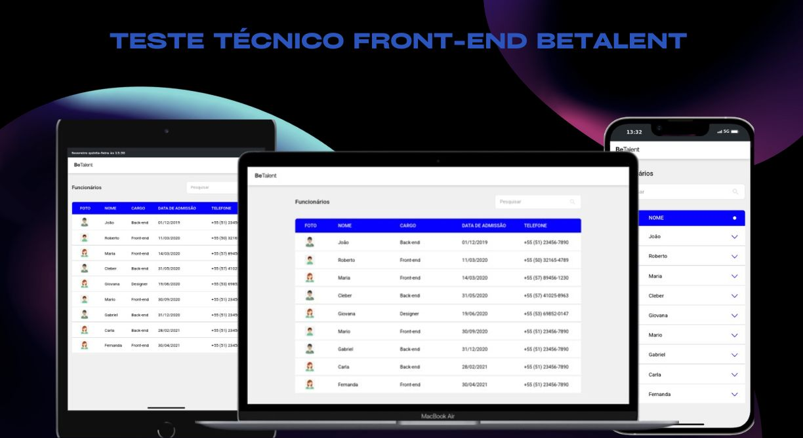

<h1 align="center">Teste Técnico Front-end BeTalent</h1>
<div align="center">
  <a href="#descrição">Descrição</a> |
  <a href="#iniciar">Iniciar</a> |
  <a href="#licença">Licença</a>
</div>

<p>
 
</p>

## Descrição
Este é um repositório de um testes técnicos em front-end da BeTalent. As principais funções da aplicação são:

- conexão com API simulada.
- Filtro por: cargo, nome e telefone, de Usuario registrado.
- formatação de data e telefone.

## Iniciar
### Pré-requisitos
- [Git](https://git-scm.com/)
- [Node.js](https://nodejs.org/en/)
- [Yarn](https://yarnpkg.com/)

### Instalação
```bash
# Clone o repositório
$ git clone https://github.com/matheus369k/teste-tecnico-front-end-betalent.git

# Entre na pasta do projeto
$ cd desafio-front-end
# Instale as dependências
$ yarn install
```
### Executando
```bash
# Inicie o back do projeto
$ yarn server
# Inicie o front do projeto
$ yarn dev
```
## Licença
Não há licença para este projeto.


